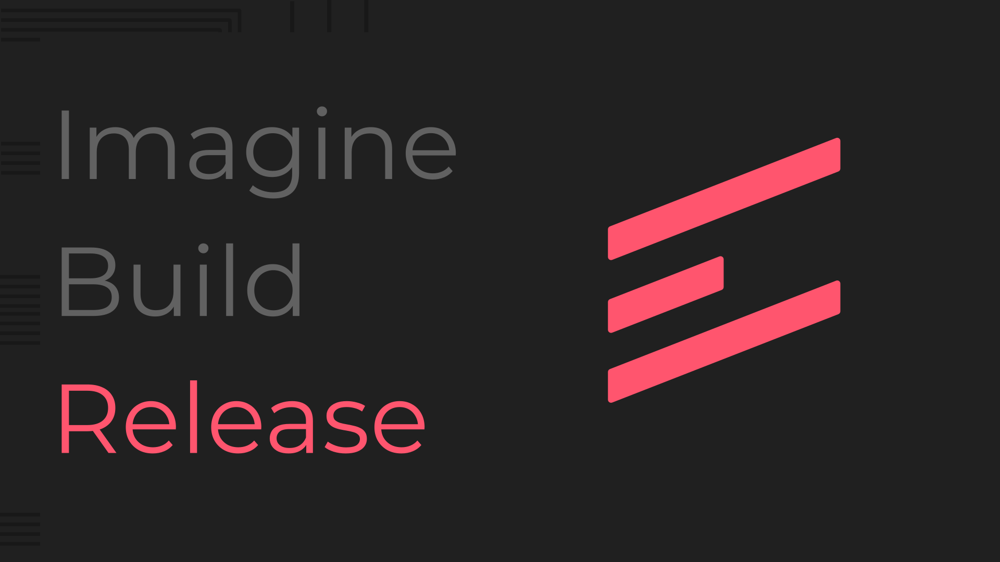
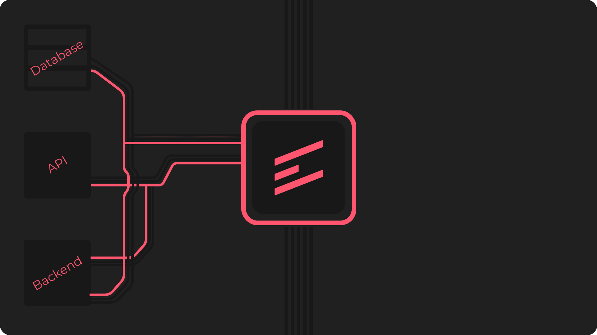

     
    
     

# Exolix Framework

Exolix is a cross-platform framework written in C++ for developing all purpos apps such as games, tools, servers and
more!
 The framework supports a wide variety of languages such as [C++](https://isocpp.org/)
, [C](https://en.wikipedia.org/wiki/ANSI_C), [Java](https://www.java.com/en/), [Python](https://www.python.org)
, [Go](https://go.dev/) and **MORE**!

## Links

- [Homepage](https://skylix.net/about/exolix)
- [Repository](https://devops.skylix.net/skylix/exolix)
- [Community](https://invite.skylix.net/skylix)
- [Documentation](https://devops.skylix.net/skylix/exolix/wiki)

## Licence [MIT](https://opensource.org/licenses/MIT)

The project __Exolix__ is governed under the MIT open source license.
 Visit the licence [here](License)
